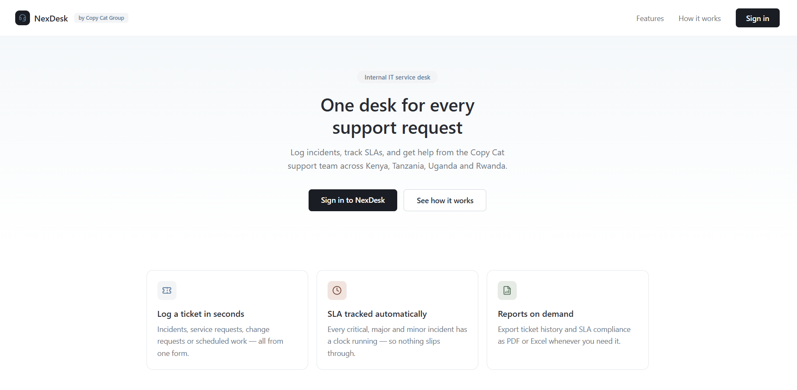
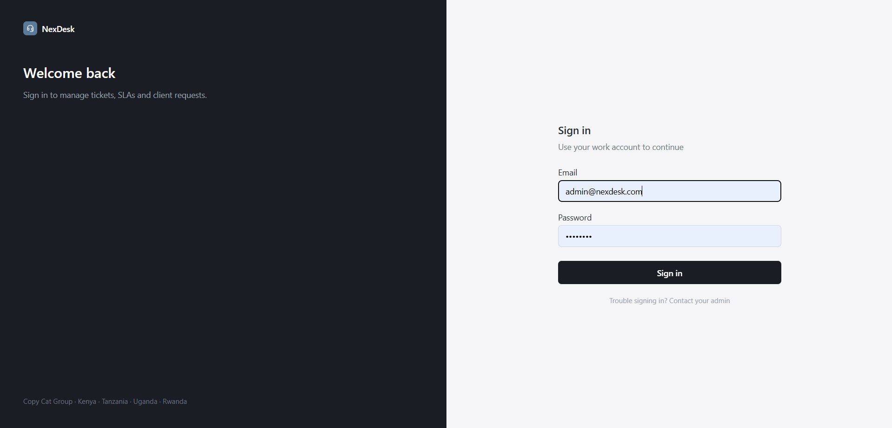
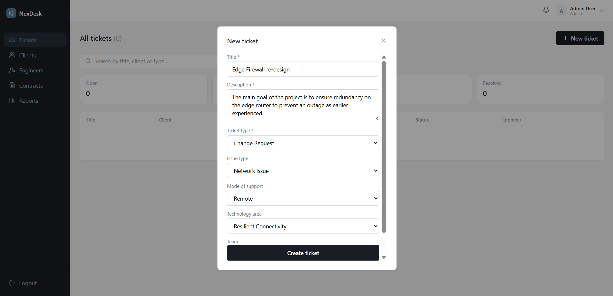
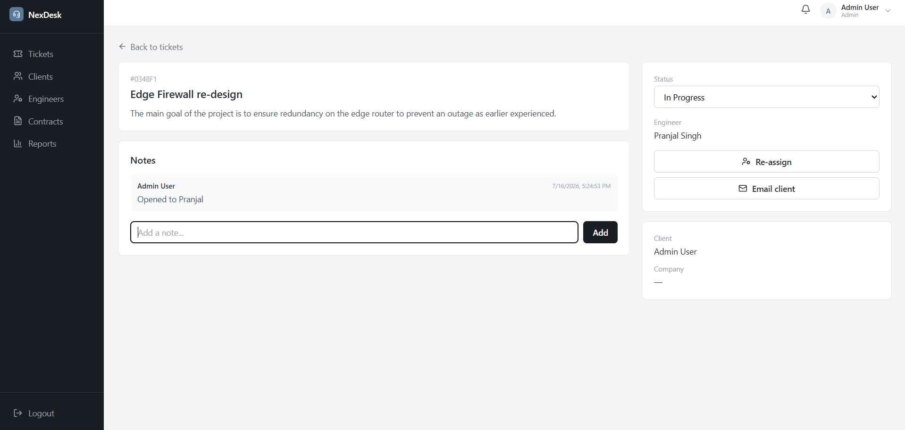
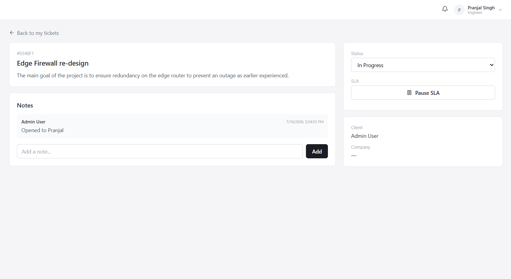
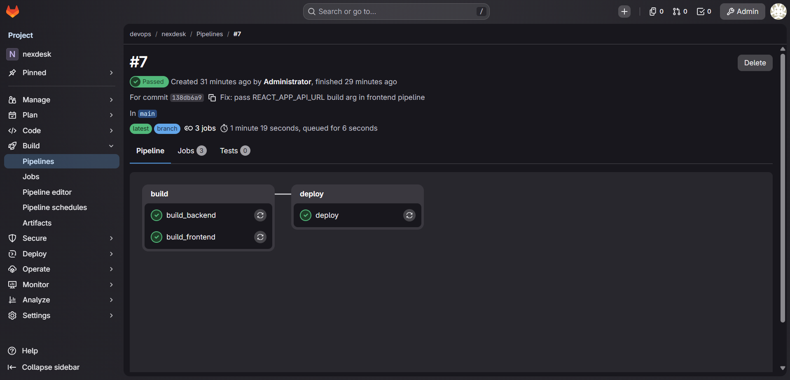
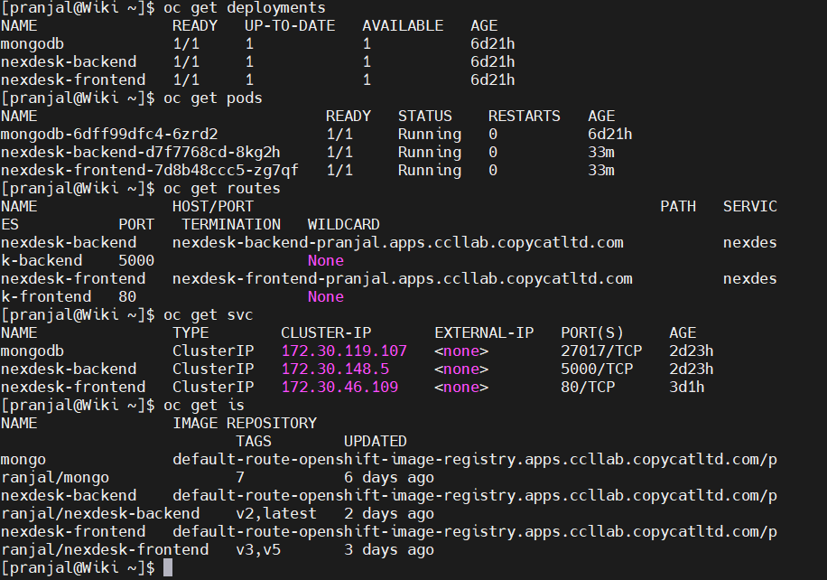

<div align="center">

# 🚀 NexDesk
### Enterprise IT Support & Ticket Management Platform

A full-stack **MERN** based IT Support Management System built for organizations to efficiently manage support tickets, engineers, clients, contracts, SLAs, and reports.

**Containerized with Docker • Automated with GitLab CI/CD • Deployed on Red Hat OpenShift**

---


</div>

---

# 📖 About

NexDesk is an enterprise-level **IT Service Management (ITSM)** platform that streamlines technical support operations.

It enables organizations to:

- 🎫 Manage support tickets
- 👨‍💻 Assign engineers
- 🏢 Manage clients
- 📄 Upload and manage contracts
- ⏱ Track SLA compliance
- 📊 Generate reports
- 🔐 Authenticate users securely

The project was built using the **MERN Stack** and deployed using modern DevOps practices including **Docker**, **GitLab CI/CD**, and **Red Hat OpenShift**.

---

# ✨ Features

## 👨‍💼 Admin

- Dashboard
- User Management
- Client Management
- Engineer Management
- Ticket Assignment
- Contract Upload
- SLA Tracking
- Reports
- Analytics

---

## 🧑‍💼 Client

- Login
- Create Tickets
- Track Ticket Status
- View Contracts
- Download Documents

---

## 👨‍🔧 Engineer

- View Assigned Tickets
- Update Ticket Status
- Pause SLA
- Add Notes
- Resolve Tickets

---

# 🏗️ Tech Stack

## Frontend

- React.js
- React Router
- Axios
- Context API

## Backend

- Node.js
- Express.js
- JWT Authentication
- Multer
- REST API

## Database

- MongoDB

## DevOps

- Docker
- Podman
- GitHub
- GitLab
- GitLab CI/CD
- Docker Hub
- Red Hat OpenShift
- Kubernetes

---

# 📂 Project Structure

```
NexDesk
│
├── backend
│   ├── controllers
│   ├── middleware
│   ├── models
│   ├── routes
│   ├── uploads
│   └── server.js
│
├── frontend
│   ├── src
│   ├── public
│   └── package.json
│
├── docker-compose.yml
├── .gitlab-ci.yml
└── README.md
```

---

# 🔐 Authentication

- JWT Authentication
- Protected Routes
- Role Based Access Control

Roles

- Admin
- Engineer
- Client

---

# 🐳 Docker

Each service is containerized.

### Backend

```
docker build -t nexdesk-backend .
```

### Frontend

```
docker build -t nexdesk-frontend .
```

---

# ☸️ OpenShift Deployment

Application deployed on **Red Hat OpenShift**

Deployment includes

- Backend Deployment
- Frontend Deployment
- MongoDB Deployment
- Services
- Routes
- Image Pulls
- Rolling Updates

---

# ⚙️ GitLab CI/CD Pipeline

The application follows a complete CI/CD workflow.

```
Developer
     │
     ▼
Git Push
     │
     ▼
GitLab Pipeline
     │
     ▼
Build Docker Images
     │
     ▼
Push Images to Docker Hub
     │
     ▼
OpenShift Deployment Update
     │
     ▼
Rolling Deployment
     │
     ▼
Application Live 🚀
```

Pipeline stages:

- Build Backend
- Build Frontend
- Push Docker Images
- Deploy to OpenShift
- Automatic Rollout

---

# 🌐 Deployment Architecture

```
                     GitHub
                        │
                        ▼
                    GitLab
                        │
                        ▼
                GitLab CI/CD Pipeline
                        │
        ┌───────────────┴───────────────┐
        ▼                               ▼
 Build Backend Image             Build Frontend Image
        │                               │
        └───────────────┬───────────────┘
                        ▼
                  Docker Hub Registry
                        │
                        ▼
             OpenShift Kubernetes Cluster
                        │
       ┌────────────────┴────────────────┐
       ▼                                 ▼
Frontend Pod                      Backend Pod
                                         │
                                         ▼
                                   MongoDB Pod
```

---

# 🚀 Installation

## Clone Repository

```
git clone <repository-url>
```

---

## Backend

```
cd backend
npm install
npm start
```

---

## Frontend

```
cd frontend
npm install
npm start
```

---

# 🔑 Environment Variables

Backend

```
PORT=5000

MONGO_URI=

JWT_SECRET=
```

Frontend

```
REACT_APP_API_URL=
```

---

# 📸 Screenshots

## Landing Page

<p align="center">

</p>

## Login Page

<p align="center">

</p>

## Admin Panel - New Ticket Page

<p align="center">

</p>

## Tickets Detail

<p align="center">

</p>

## Engineer Panel - Ticket page

<p align="center">

</p>

##  Gitlab Pipeline

<p align="center">

</p>

##  OpenShift Deployment

<p align="center">

</p>

---

# 💡 Challenges Solved

During the development and deployment of NexDesk, several real-world DevOps challenges were identified and resolved, including:

- Docker image creation and optimization
- GitLab Runner configuration
- Docker Hub authentication and image publishing
- OpenShift image deployment
- Kubernetes rolling updates
- Environment variable management
- React production build configuration
- Backend container permission issues
- CrashLoopBackOff debugging
- Image tag management
- CI/CD pipeline validation
- Container networking
- OpenShift deployment troubleshooting

These debugging and deployment experiences significantly strengthened practical knowledge of containerization and cloud-native application deployment.

---

# 🎯 Future Improvements

- WebSocket Real-Time Updates
- Redis Caching
- Kubernetes ConfigMaps & Secrets
- Monitoring with Prometheus & Grafana
- Helm Charts
- GitLab Security Scanning
- Automated Testing
- Multi-Environment Deployments
- Horizontal Pod Autoscaling

---

# 📚 Learning Outcomes

This project provided practical experience in:

- MERN Stack Development
- REST API Design
- JWT Authentication
- Docker Containerization
- Podman
- Git & GitHub
- GitLab CI/CD
- Docker Hub
- Kubernetes Fundamentals
- Red Hat OpenShift
- Rolling Deployments
- Production Debugging
- DevOps Best Practices

---

# 👨‍💻 Author

**Pranjal Singh**

B.Tech Computer Science Engineering

DevOps | Full Stack Development

---

# ⭐ If you like this project

Please consider giving it a **Star ⭐**

It motivates further development and improvements.

---

<div align="center">

### 🚀 Built with passion, deployed with DevOps, and powered by OpenShift.

</div>